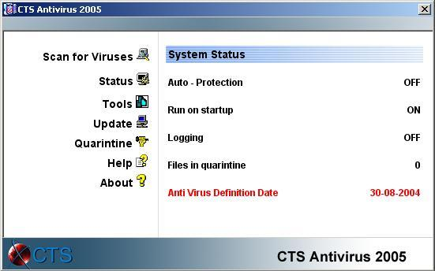



## CTS Anti Virus 2005 \+ AV Engine \( Updated \)

### Description

This is the latest release of my Anti Virus series. This version now contains a separate Anti Virus Engine DLL. So it can easily be included to any GUI you want. A demo GUI comes with the DLL that shows the usage of the Engine. The GUI is 100% re-programmed. I've decide to create a Web - Interface like Norton Anti Virus has. The searching algorithms are optimized and the scanning speed has nearly doubled. The signature file now contains 33674(!) entries: I've decided to go away from CRCs and to scan for Virus strings. But the AV Engine still scans for CRC, but it's recommended to use the string search (due to big size of the full signature file (1.45MB) I’ve only included a small (600Kb) demo. The full version can be downloaded with the included update routine.). Since the first release the software has grown to 4739 lines of code. I hope that you like my work! Any feedback would be really appreciated!
 
### More Info
 

             |
---                |---
**Submitted On**   |2004-10-02 16:49:42
**By**             |[Cyber Chris](https://github.com/Planet-Source-Code/PSCIndex/blob/master/ByAuthor/cyber-chris.md)
**Level**          |Advanced
**User Rating**    |5.0 (215 globes from 43 users)
**Compatibility**  |VB 3\.0, VB 4\.0 \(16\-bit\), VB 4\.0 \(32\-bit\), VB 5\.0, VB 6\.0
**Category**       |[Complete Applications](https://github.com/Planet-Source-Code/PSCIndex/blob/master/ByCategory/complete-applications__1-27.md)
**World**          |[Visual Basic](https://github.com/Planet-Source-Code/PSCIndex/blob/master/ByWorld/visual-basic.md)
**Archive File**   |[CTS\_Anti\_V1799771022004\.zip](https://github.com/Planet-Source-Code/cyber-chris-cts-anti-virus-2005-av-engine-updated__1-56479/archive/master.zip)

